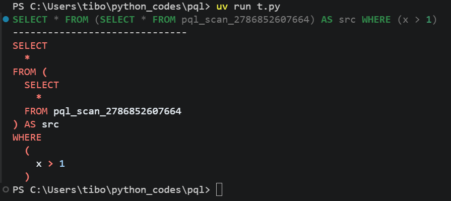

# belouga

`belouga` is a lazy dataframe library for DuckDB with a Polars-like API.

It compiles expression trees to DuckDB SQL via `sqlglot`, which are then converted to SQL queries and passed to DuckDB for execution.

It targets the case where DuckDB is the execution engine, and you want a fluent dataframe API close to Polars rather than handwritten SQL or a generic multi-backend abstraction.

## Quick Start

### Installation

```shell
uv add https://github.com/OutSquareCapital/belouga.git
```

### Example

```python
import belouga as bl

data = {
    "city": ["Paris", "Paris", "Berlin", "Berlin"],
    "price": [100, 120, 80, 90],
    "qty": [1, 2, 3, 4],
    "is_promo": [False, True, False, True],
}
query = (
    bl
    .from_dict(data)
    .filter(bl.col("price").ge(90))
    .with_columns(revenue=bl.col("price").mul("qty"))
    .group_by("city")
    .agg(
        total_revenue=bl.col("revenue").sum(),
        avg_price=bl.col("price").mean(),
        promo_rows=bl.col("is_promo").sum(),
    )
    .sort("total_revenue", descending=True)
)
```

Output:

```shell
 ┌─────────┬───────────────┬───────────┬────────────┐
 │  city   │ total_revenue │ avg_price │ promo_rows │
 │ varchar │    int128     │  double   │   int128   │
 ├─────────┼───────────────┼───────────┼────────────┤
 │ Berlin  │           360 │      90.0 │          1 │
 │ Paris   │           340 │     110.0 │          1 │
 └─────────┴───────────────┴───────────┴────────────┘
```

You can inspect the generated SQL query directly, format it, with syntax highlighting and various available themes:

```python
import belouga as bl

query = bl.LazyFrame({"x": [1, 2, 3]}).filter(bl.col("x").gt(1))
sql = query.sql_query()

sql.show("friendly")
print("---" * 10)
sql.show(pretty=True)
```



You can also inspect the DuckDB plan:

```python
print(query.explain())
```

Output:

```shell
┌───────────────────────────┐
│         PROJECTION        │
│    ────────────────────   │
│             #1            │
│                           │
│          ~0 rows          │
└─────────────┬─────────────┘
┌─────────────┴─────────────┐
│           FILTER          │
│    ────────────────────   │
│          (x > 1)          │
│                           │
│          ~0 rows          │
└─────────────┬─────────────┘
┌─────────────┴─────────────┐
│           UNNEST          │
└─────────────┬─────────────┘
┌─────────────┴─────────────┐
│      COLUMN_DATA_SCAN     │
│    ────────────────────   │
│           ~1 row          │
└───────────────────────────┘
```

## API

## Dependencies

### DuckDB

`belouga` uses `DuckDB` as the execution engine.

### sqlglot

`sqlglot` is used to build and manipulate SQL ASTs for the IR between `LazyFrame`/`Expr` operations and the generated SQL queries.

### Pyochain

Iterable-returning methods return `pyochain` objects, so column lists and schema views stay chainable:

```python
import belouga as bl

lf = bl.LazyFrame({"price": [1, 2, 3], "name": ["x", "y", "z"]})

cols = lf.columns.iter().filter(lambda col: col.startswith("p"))
result = lf.select(cols).columns
print(result)

# PyoKeysView(Dict('price': DataType(this=DType.INT, nested=False)))
```

## Comparison with other tools

**Narwhals** is a compatibility layer aimed at library authors who want to write dataframe-agnostic code that runs across Polars, pandas, and other backends. The API is Polars-inspired but intentionally limited to what can be expressed portably — it is not trying to expose deep DuckDB surface. End users doing data work are not the primary audience.

**Ibis** targets portability across 20+ backends (DuckDB, BigQuery, Snowflake, Spark, ...) under a single Ibis-native API. It also uses `sqlglot` internally and can use DuckDB as a local backend. The tradeoff is that the API stays generic enough to compile to all those targets, so DuckDB-specific functionality is not exposed. If you need the same query graph to run on multiple engines, Ibis is the right tool.

**SQLFrame** implements the PySpark DataFrame API on top of SQL engines. The syntax is PySpark-first — `withColumn`, `F.col`, `SparkSession` — not Polars-like. It is designed for teams who want to run PySpark transformation pipelines on DuckDB, BigQuery, or Snowflake without an actual Spark cluster.

`belouga` sits in a different spot: Polars-like syntax, DuckDB as the fixed target, and access to the full DuckDB function surface (700+ methods, geospatial, `GROUP BY ALL`, catalog introspection) that generalist multi-backend tools do not expose.

## How It Works

`belouga` compiles `Expr` and `LazyFrame` operations into a `sqlglot` AST, then materializes queries through `ScanSource` against a DuckDB relation. Generated code in `src/belouga/_fns.py` covers most of the DuckDB function catalog.

## Contributing

If you want to contribute, start with [CONTRIBUTING.md](CONTRIBUTING.md).
